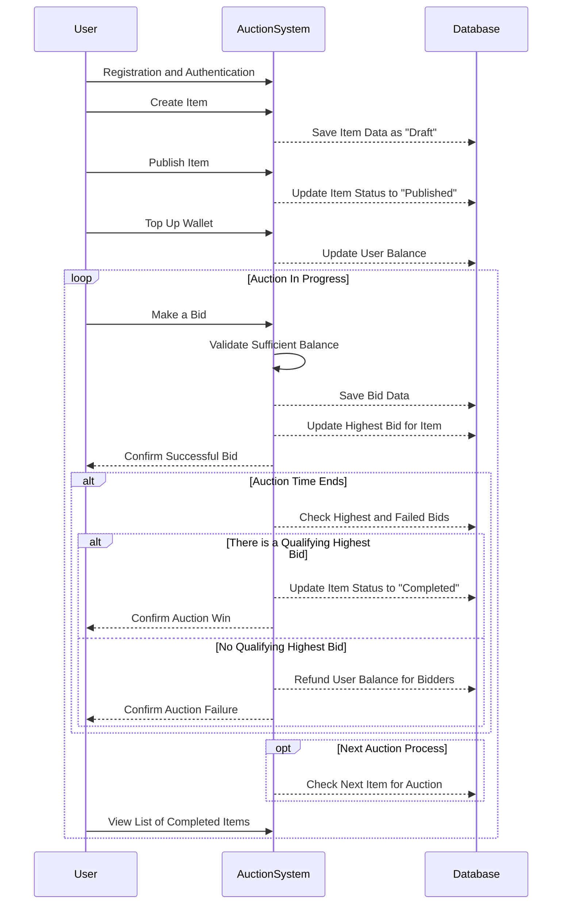

# Auc-Backend

AUC-Backend is a backend system for an auction or bidding platform. It is built using NestJS, TypeScript, TypeORM, PostgreSQL, Redis, and NestJS/Bull for queueing and background jobs.

## About

This application allows users to register and log in to the system. Once logged in, users can create items for auction. Each item has a starting price, a time window for how long the auction lasts, and a status. When an item is first created, its status is 'draft'. The user can then publish the item when they are ready for it to be auctioned.

To make a bid, users must first deposit money into their account. There is a validation check to ensure that the user's balance is greater than the bid price. Users can only bid on items that have been published. After making a bid on an item, users can make another bid after 5 seconds. Each bid deducts the bid amount from the user's balance.

Users can view items that have completed auctions with the status 'completed' or items with the status 'published' which are ready for bids. Bids can only be made within the item's time window.

When the time window for bids ends, the system will find the highest bid and declare that user as the winner. The system will then refund the deducted money to the users who did not win the bid.



## Getting Started

These instructions will get you a copy of the project up and running on your local machine for development and testing purposes.

### Prerequisites

- Node.js
- PostgreSQL
- Redis
- Docker (optional)

### Installation (manual)

1. Clone the repo

```sh
  git clone https://github.com/muhammadtaufan/auc-backend.git
```

2. Install Yarn packages

```sh
  yarn install
```

3. Copy the `.env.example` file and create a new `.env` file with your own configurations.

4. Run the migrations

```sh
  yarn run migration:run
```

1. Start the server

```bash
  # development
  yarn run start

  # watch mode
  yarn run start:dev

  # production mode
  yarn run start:prod
  ```

### Using Docker

1. Build the Docker image

```sh
  docker-compose build
 ```

2. Run the Docker container

```sh
  docker-compose up
```

## Contact

Your Name - <mtaufan.dev@gmail.com>

Project Link: [https://github.com/muhammadtaufan/auc-backend](https://github.com/muhammadtaufan/auc-backend)
